# Introduction

**Freight is a professional, zero-dependency Git hook manager built for modern development teams.**

### The Problem
Most Git hook managers force a specific runtime on your entire team. If you use Husky, everyone needs Node.js. If you use pre-commit, everyone needs Python. This creates "it works on my machine" friction and bloats your environment.

### The Solution: Freight
Freight is different. It ships as a single, static Go binary with **zero runtime dependencies**. 

- **Static Portability:** Works everywhere without requiring a language runtime.
- **Declarative manifest:** Manage every hook in your project via one `railcar.json` file.
- **Non-Invasive:** Freight doesn't own your repo; it just conducts the traffic.

### Architecture: Conductor & Railcar

```mermaid
graph LR
    A[Git Event<br/>e.g., pre-commit] --> B
    B["🚂 Conductor Binary"]
    B --> C["📄 Railcar Manifest<br/>(railcar.json)"]
    B --> D
    
    subgraph D [Actions]
        direction TB
        L[Linting]
        T[Testing]
        S[Security Scan]
    end

    style B fill:#0070f3,stroke:#333,stroke-width:2px,color:#fff
    style C fill:#d3d3d3,stroke:#333,stroke-width:2px
```

Freight operates using a high-performance 'Conductor/Railcar' architecture:

1.  **The Conductor:** When you run `freight init`, a specialized `conductor` binary is placed at your repository root.
2.  **The Railcar:** A `railcar.json` manifest is created to define your hook logic.
3.  **Execution:** When a Git hook (like `pre-commit`) is triggered, the Conductor binary immediately executes the logic defined in the Railcar.

This ensures that your hooks are fast, version-controlled, and completely portable across your entire team.
